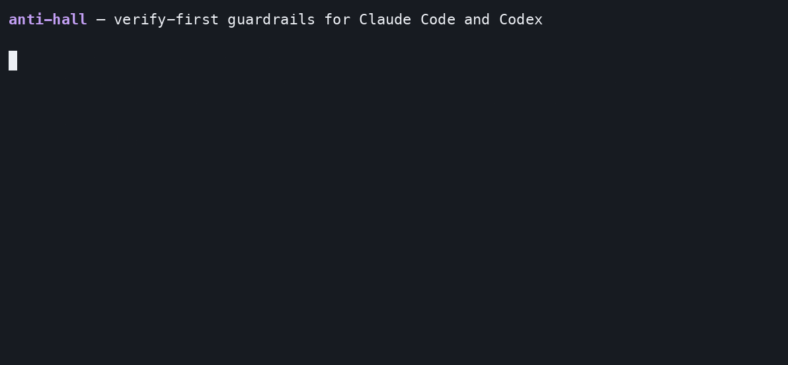

<div align="center">


# 🛡️ anti-hall

### Make Claude Code and Codex *verify before they claim* — with platform-native guardrails and workflow skills.

[](https://github.com/talas9/anti-hall/actions/workflows/test.yml) [](https://github.com/talas9/anti-hall/releases) [](LICENSE)   

</div>

<p align="center">
  
</p>

## What it does

- Stops your coding assistant from stating things it has not checked: invented library functions, "it works" without running anything, "done" with tasks still open.
- Blocks risky git actions outright: force-pushes, and AI credit lines in commit messages and GitHub PR/issue/release text.
- Keeps the main conversation responsive by pushing heavy commands and file edits to helper agents, and caps runaway agent spawning.
- Adds skills you can call by name for debugging to a proven root cause, reviewing risky changes, and writing a session handover.
- Works with Claude Code (plugin) and Codex (separate port). Pure Node, nothing else to install.

## Install

Needs **Node.js 22+** on your `PATH` (`node --version`).

**Claude Code:**

```bash
/plugin marketplace add talas9/anti-hall
/plugin install anti-hall@anti-hall
```

**Codex** (clone the repo, then run the installer; add `--global` for user-wide, `--dry-run` to preview):

```bash
git clone https://github.com/talas9/anti-hall.git && cd anti-hall
node plugins/anti-hall/codex/install-codex.js
```

Add `.anti-hall/` to your project's `.gitignore`: anti-hall keeps per-project session notes there (or run `/anti-hall:doctor --repair`, which excludes it locally).

**Check it worked:** ask "is anti-hall working" (runs the `doctor` skill), or run `/anti-hall:settings`.

**Uninstall:** see the documentation (below).

### Enable Jev

<!-- jev-recommend:start -->
> **Recommended: enable Jev, the optional classifier, for more accurate guards.**
>
> It gives guards such as the speculation check a model's second opinion on top of pattern matching, and it can only add blocks, never remove one. **Costs:** optional and off by default; needs your own Vercel AI Gateway or TypeSafe API key; sends the text a guard judges to the provider you choose; uses provider credits. Details: [PRIVACY.md](PRIVACY.md).
>
> Enable: say "activate jev" (runs the `jev` skill). The full text and the measured result are in the Jev page of the documentation (below).
<!-- jev-recommend:end -->

## Network and data

No telemetry or analytics. One request is on by default: an update check to GitHub (a tag-list request, no project data; turn it off with `versionAlerts.antiHall`). The optional classifier features (Jev, semantic judge, mesh triage) are off by default and send the text they judge only to the provider you configure. Everything else stays in `~/.anti-hall/` and `<repo>/.anti-hall/`. Full table: [PRIVACY.md](PRIVACY.md).

## Documentation

**[Documentation start page](docs/README.md)**: install and uninstall, what each guard blocks and how to turn it off, settings, Jev, DevSwarm, troubleshooting, contributing, security and the changelog.

## License

MIT © Mohammed Talas. See [LICENSE](LICENSE).
